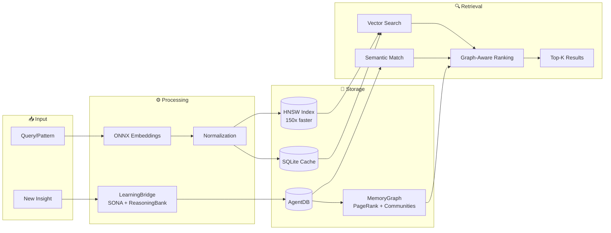

# Intelligence & Memory

Ruflo's memory system is the core of its self-learning capability. Every task execution feeds patterns into a persistent vector store that improves future routing and context retrieval.

## Memory Architecture



## RuVector Components

| Component | Purpose | Performance |
|-----------|---------|-------------|
| **SONA** | Self-Optimizing Neural Architecture — learns optimal routing | <0.05ms adaptation |
| **EWC++** | Elastic Weight Consolidation — prevents catastrophic forgetting | Preserves learned patterns |
| **Flash Attention** | Optimized attention computation | 2.49–7.47x speedup |
| **HNSW** | Hierarchical Navigable Small World vector search | Sub-millisecond retrieval |
| **ReasoningBank** | Pattern storage with BM25+semantic hybrid search | RETRIEVE→JUDGE→DISTILL |
| **Hyperbolic (Poincaré)** | Hierarchical code relationship embeddings | Better tree-structured data |
| **LoRA / MicroLoRA** | Low-Rank Adaptation for efficient fine-tuning | 128x compression |
| **Int8 Quantization** | Memory-efficient weight storage | ~4x memory reduction |
| **SemanticRouter** | Semantic task routing via cosine similarity | Fast intent routing |
| **9 RL Algorithms** | Q-Learning, SARSA, A2C, PPO, DQN, Decision Transformer… | Task-specific learning |

## Hierarchical Memory Tiers

```
┌─────────────────────────────────────────────┐
│  Working Memory                             │  ← Active context (1MB limit)
├─────────────────────────────────────────────┤
│  Episodic Memory                            │  ← Recent patterns, importance-ranked
├─────────────────────────────────────────────┤
│  Semantic Memory                            │  ← Consolidated knowledge, persistent
└─────────────────────────────────────────────┘
```

Memories are promoted from Episodic → Semantic via automatic consolidation.

## AgentDB Controllers

Ruflo integrates AgentDB v3, providing 20+ memory controllers:

### Core
| Controller | Tool | Description |
|-----------|------|-------------|
| HierarchicalMemory | `agentdb_hierarchical-store/recall` | 3-tier memory with Ebbinghaus forgetting curves |
| MemoryConsolidation | `agentdb_consolidate` | Clusters and merges related memories |
| BatchOperations | `agentdb_batch` | High-throughput bulk memory management |
| ReasoningBank | `agentdb_pattern-store/search` | BM25+semantic hybrid pattern search |

### Intelligence
| Controller | Tool | Description |
|-----------|------|-------------|
| SemanticRouter | `agentdb_semantic-route` | Routes tasks via vector similarity |
| ContextSynthesizer | `agentdb_context-synthesize` | Auto-generates context summaries |
| GNNService | — | Graph neural network for intent classification |
| SonaTrajectoryService | — | Records and predicts agent learning trajectories |

### Security & Integrity
| Controller | Tool | Description |
|-----------|------|-------------|
| GuardedVectorBackend | — | Cryptographic proof-of-work before vector ops |
| MutationGuard | — | Token-validated mutations with cryptographic proofs |
| AttestationLog | — | Immutable audit trail of all memory operations |

## Self-Learning Cycle (ADR-049)

1. **Insights** are extracted from completed tasks
2. **LearningBridge** routes insights to SONA and ReasoningBank (0.12 ms/insight)
3. **MemoryGraph** builds a PageRank + community-detection knowledge graph (2.78 ms/1k nodes)
4. **AgentMemoryScope** handles cross-agent knowledge transfer with 3-scope isolation (1.25 ms/transfer)
5. Confidence scores decay for unused patterns; frequently-used patterns get boosted

## Vector Search Details

- **Embedding dimensions**: 384 (MiniLM via ONNX — local, no API calls, 75x faster)
- **Algorithm**: HNSW
- **Similarity scoring**: 0–1
  - `> 0.7` — strong match, use pattern directly
  - `0.5–0.7` — partial match, adapt pattern
  - `< 0.5` — weak match, create new pattern
