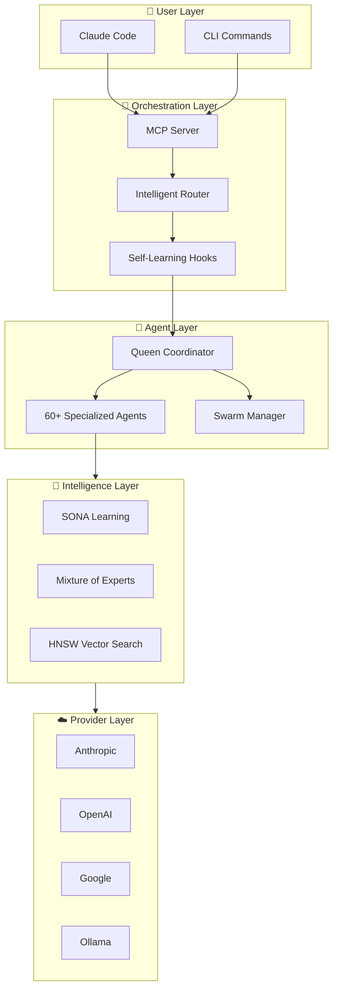
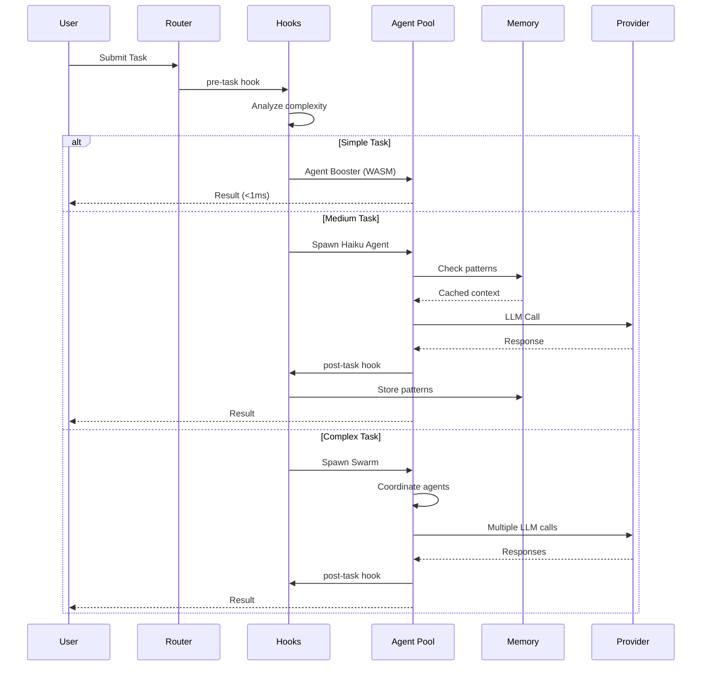

# Architecture Overview

Ruflo is structured in six layers, from user-facing interfaces down to LLM providers.

## System Diagram



## Layers Explained

### User Layer
Entry points: **Claude Code** (interactive) and the **Ruflo CLI** for direct commands.

### Orchestration Layer
- **MCP Server** — exposes 259 tools to any MCP-compatible client
- **Intelligent Router** — Q-Learning based routing with 89% accuracy; dispatches to WASM, agent, or swarm
- **Self-Learning Hooks** — pre/post/progress lifecycle hooks that learn from every execution

### Agent Layer
- **Queen Coordinator** — strategic, tactical, and adaptive queens that manage and validate agent output
- **60+ Specialized Agents** — coder, tester, reviewer, architect, security, documenter, and more
- **Swarm Manager** — coordinates topology (hierarchical/mesh/ring/star) and consensus (Raft/BFT/Gossip)

### Intelligence Layer
- **SONA** — Self-Optimizing Neural Architecture; learns routing from outcomes in <0.05ms
- **Mixture of Experts (MoE)** — 8 expert networks with dynamic gating for task classification
- **HNSW Vector Search** — sub-millisecond pattern retrieval; 150x–12,500x faster than linear scan

### Memory Layer
See [Intelligence & Memory](memory.md) for the full breakdown.

### Provider Layer
Supports **6 LLM providers** with automatic failover and cost-based routing:
Anthropic · OpenAI · Google · Cohere · Groq · Ollama (local)

---

## Request Flow



## Domain-Driven Design

Ruflo is organized into 5 bounded contexts that prevent cross-domain pollution:

```
┌─────────────┐  ┌─────────────┐  ┌─────────────┐
│    Core     │  │   Memory    │  │  Security   │
│  Agents,    │  │  AgentDB,   │  │  AIDefence, │
│  Swarms,    │  │  HNSW,      │  │  Validation │
│  Tasks      │  │  Cache      │  │  CVE Fixes  │
└─────────────┘  └─────────────┘  └─────────────┘
┌─────────────┐  ┌─────────────┐
│ Integration │  │Coordination │
│ agentic-    │  │  Consensus, │
│ flow, MCP   │  │  Hive-Mind  │
└─────────────┘  └─────────────┘
```
