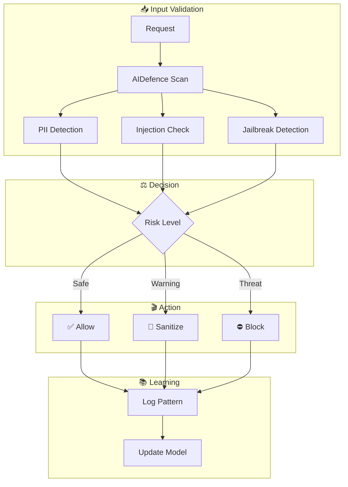

# Security

Ruflo includes production-grade security via the **AIDefence** layer.

## Security Flow



## Protections

| Protection | Description |
|------------|-------------|
| **Prompt injection** | Detects and blocks injection attempts in user input |
| **PII detection** | Flags personally identifiable information |
| **Jailbreak detection** | Identifies attempts to bypass model guidelines |
| **Path traversal** | Prevents `../` and absolute path escapes |
| **Command injection** | Blocks shell metacharacters in tool inputs |
| **Credential handling** | Safe storage, never logged or echoed |
| **bcrypt** | Password hashing for any persisted credentials |
| **Input validation** | Zod schemas on all MCP tool parameters |

## AIDefence Performance

- Detection latency: **<10ms**
- Learns from blocked patterns — new threat signatures are added automatically

## Memory Security

The GuardedVectorBackend controller requires cryptographic **proof-of-work** before allowing vector insert or search operations, preventing unauthorized memory poisoning.

MutationGuard enforces token-validated mutations with cryptographic proofs. Every memory operation is written to an immutable AttestationLog.

## CVE Hardening

Ruflo's dependency tree is regularly audited. Known CVEs are patched before release. Run:

```bash
npx ruflo@latest --doctor
```

to check for dependency vulnerabilities in your local install.
