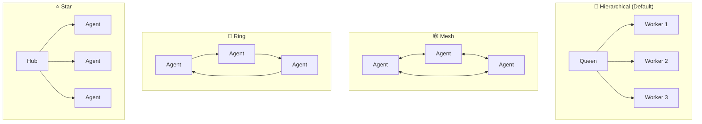

# Swarm Topologies

Ruflo supports four swarm topologies for coordinating multiple agents.

## Topology Overview



## Choosing a Topology

| Topology | Best For | Drift Risk |
|----------|----------|------------|
| `hierarchical` | Most coding tasks — queen validates output | Low |
| `mesh` | Research / exploration — peer-to-peer collaboration | Medium |
| `ring` | Sequential pipelines — output feeds next agent | Low |
| `star` | Fan-out / fan-in — hub coordinates many workers | Medium |

## Recommended Configuration (Anti-Drift)

```javascript
swarm_init({
  topology: "hierarchical",  // Single coordinator enforces alignment
  maxAgents: 8,              // Smaller teams = less drift surface
  strategy: "specialized"    // Clear roles reduce ambiguity
})
```

## Consensus Protocols

Ruflo supports five consensus algorithms for fault-tolerant agent decisions:

| Protocol | Use Case | Fault Tolerance |
|----------|----------|-----------------|
| **Raft** | Leader election, authoritative state | Leader failure |
| **Byzantine (BFT)** | Untrusted or noisy agents | Up to 1/3 failing |
| **Gossip** | Eventually-consistent shared state | Network partitions |
| **CRDT** | Conflict-free concurrent updates | Full partition tolerance |
| **Majority** | Simple voting | Simple failures |

## Hive Mind

The Hive Mind is the queen-led coordination layer:

| Component | Purpose |
|-----------|---------|
| **Strategic Queen** | Long-range planning, architecture decisions |
| **Tactical Queen** | Task execution coordination |
| **Adaptive Queen** | Real-time optimization and load balancing |
| **8 Worker Types** | Researcher, Coder, Analyst, Tester, Architect, Reviewer, Optimizer, Documenter |

Collective memory is shared via LRU cache + SQLite persistence (WAL mode).

## Task → Agent Routing Guide

| Code | Task Type | Recommended Agents |
|------|-----------|-------------------|
| 1 | Bug Fix | coordinator, researcher, coder, tester |
| 3 | Feature | coordinator, architect, coder, tester, reviewer |
| 5 | Refactor | coordinator, architect, coder, reviewer |
| 7 | Performance | coordinator, perf-engineer, coder |
| 9 | Security | coordinator, security-architect, auditor |
| 11 | Memory | coordinator, memory-specialist, perf-engineer |
